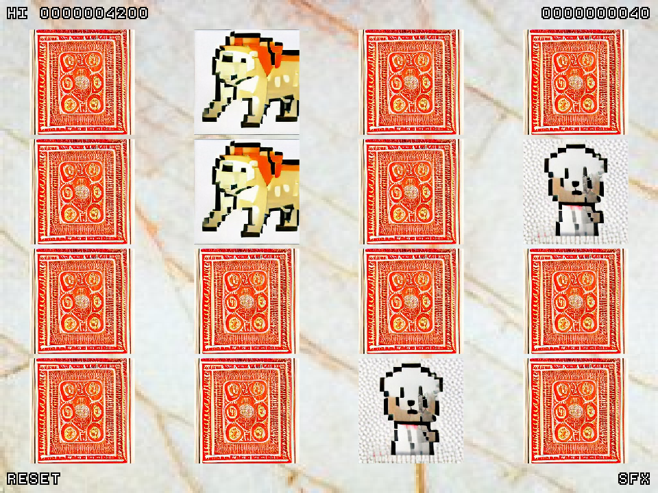

# DALL-E Matcher
DALL-E Matcher is a simple card matching game written in JavaScript with [Kaboom.js](https://kaboomjs.com/) made for both the [GMTK Game Jam 2022](https://itch.io/jam/gmtk-jam-2022) and [OGAM14](https://itch.io/jam/one-game-a-month-14). The game utilises exclusively game art from [DALL-E Mini](https://www.craiyon.com/), using prompts such as "[animal] pixel art",  "playing card back", and "marble texture". The game is available to play, for free, in your browser at: https://swilliamsio.itch.io/dall-e-matcher

All programming was done by [s-williams](https://github.com/s-williams).
